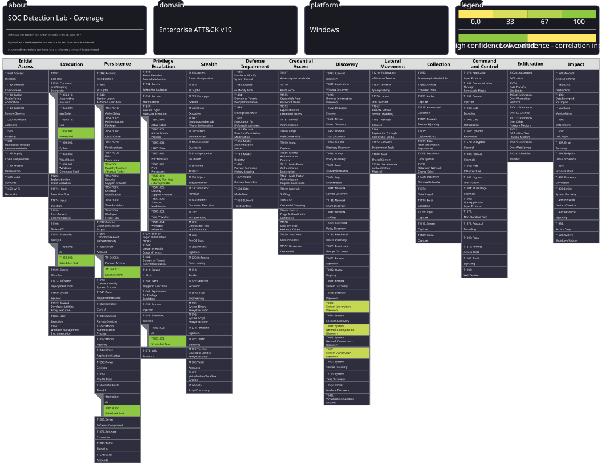

# SOC Detection Lab

Detection rules I wrote and tested in a home lab. Splunk for the SIEM, Sysmon for
endpoint telemetry, Atomic Red Team to run the attacks.

Every rule here was tested the same way: run the attack, find it in Splunk, write a
query, then check what else that query catches and narrow it. The before and after
numbers are in each writeup.

18 detections across 6 ATT&CK tactics.

## Setup

    [ Windows 11 VM ]                 [ Ubuntu VM ]
      Sysmon               ------>      Splunk
      Atomic Red Team       :9997       indexes + search
      Universal Forwarder

Build notes, and the problems I hit along the way, are in setup/01-lab-setup.md

## Detections

| ID | Technique | Tactic | Data source | Result |
|---|---|---|---|---|
| T1059.001 | PowerShell | Execution | Sysmon 1 | 4 > 2, 3 FPs removed |
| T1059.003 | Windows Command Shell | Execution | Sysmon 1 | 154 > 5, 149 FPs removed |
| T1569.002 | Service Execution | Execution | Sysmon 1 | 2 hits, no FPs |
| T1070.001 | Clear Event Logs | Defense Evasion | Sysmon 1, System 104 | 1 hit, no FPs |
| T1218.011 | Rundll32 | Defense Evasion | Sysmon 1 | 11 > 1, 10 FPs removed |
| T1218.010 | Regsvr32 | Defense Evasion | Sysmon 1 | 2 hits, no FPs |
| T1197 | BITS Jobs | Defense Evasion | Sysmon 1 | 1 hit, no FPs |
| T1027 | Obfuscated Files | Defense Evasion | Sysmon 1 | 1 hit, no FPs |
| T1547.001 | Registry Run Keys | Persistence | Sysmon 13 | 7 > 1, 6 FPs removed |
| T1053.005 | Scheduled Task | Persistence | Sysmon 1 | 2 hits, no FPs |
| T1136.001 | Create Local Account | Persistence | Sysmon 1, Security 4720/4732 | 4 > 2, 2 FPs removed |
| T1543.003 | Windows Service | Persistence | Sysmon 13 | 2 hits, no FPs |
| T1082 | System Info Discovery | Discovery | Sysmon 1 | 21 hits, see below |
| T1033 | User Discovery | Discovery | Sysmon 1 | 19 hits, see below |
| T1016 | Network Discovery | Discovery | Sysmon 1 | 5 hits, see below |
| - | Discovery Burst | Discovery | Sysmon 1 | 60 events > 2 alerts |
| T1003.002 | SAM Registry Dump | Credential Access | Sysmon 1 | 7 hits, no FPs |
| T1105 | Ingress Tool Transfer | Command and Control | Sysmon 1 | 1 hit, no FPs |

## Start here

**detections/discovery-burst/** is the one I'd read first.

I wrote three separate discovery rules and they got 21, 19 and 5 hits in a lab that
barely gets used. All three were unusable, because whoami run by an attacker and
whoami run by an admin produce identical events. Nothing in the log tells them apart.

So I stopped detecting the commands and detected the pattern instead - four or more
different discovery commands from the same parent process inside five minutes. That
collapsed 60 events into 2 alerts, and both were real reconnaissance bursts.

**detections/T1059.003-windows-command-shell/** has the biggest tuning job. 154 hits
down to 5. 14 of the false positives turned out to be one MSI installer spawning
cmd.exe fourteen times in the same second, all matching because installers run from
temp folders.

**detections/T1547.001-registry-run-keys/** has the most careful exclusions. The
false positives were Microsoft Edge and rundll32.exe. I didn't exclude them by process
name, because malware gets named msedge.exe all the time - the exclusions match on
full path plus the specific registry value plus the account it ran as.

**detections/T1136.001-create-local-account/** is where a rule returned nothing and I
assumed it was broken. It wasn't. The account management audit subcategory was never
enabled, so Windows wasn't generating the events at all.

## Techniques I couldn't detect

**T1003.001 LSASS Memory.** Windows 11 runs LSASS as a protected process
(RunAsPPL=2). The kernel blocks the handle open that credential dumping needs, so the
attack fails before it produces telemetry. I wrote T1003.002 instead, which is the
registry-based technique attackers fall back to on modern Windows.

**T1055 Process Injection.** Needs Sysmon ProcessAccess events, which I could not get
loaded into the config. Same blocker as above.

Writing these up rather than quietly dropping them, because "why this technique isn't
detectable here" is worth as much as the rules that worked.

## Notes

Splunk is on UTC and the Windows VM is on IST, so timestamps in screenshots differ
by 5:30.

The coverage layer targets ATT&CK v19. Note that T1070.001 was renumbered to
T1685.005 in v19 and moved from Defense Evasion into the new Defense Impairment
tactic. Folder names still use the old ID because that's what existing Sigma rules
and detection writeups reference.
